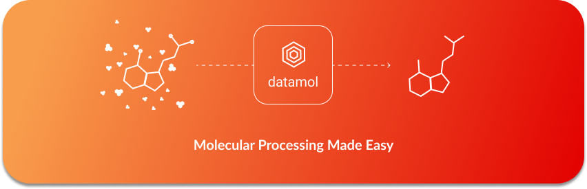

<div align="center">
    
    <h3>Molecular Manipulation Made Easy</h3>
</div>

---

[](https://zenodo.org/badge/latestdoi/341603042)
[](https://mybinder.org/v2/gh/datamol-org/datamol/main?urlpath=lab/tree/docs/tutorials/The_Basics.ipynb)
[](https://pypi.org/project/datamol/)
[](https://anaconda.org/conda-forge/datamol)
[](https://pypi.org/project/datamol/)
[](https://anaconda.org/conda-forge/datamol)
[](https://pypi.org/project/datamol/)
[](https://github.com/datamol-org/datamol/blob/main/LICENSE)
[](https://github.com/datamol-org/datamol/stargazers)
[](https://github.com/datamol-org/datamol/network/members)
[](https://codecov.io/gh/datamol-org/datamol)

Datamol is a python library to work with molecules. It's a layer built on top of [RDKit](https://www.rdkit.org/) and aims to be as light as possible.

- 🐍 Simple pythonic API
- ⚗️ RDKit first: all you manipulate are `rdkit.Chem.Mol` objects.
- ✅ Manipulating molecules often rely on many options; Datamol provides good defaults by design.
- 🧠 Performance matters: built-in efficient parallelization when possible with optional progress bar.
- 🕹️ Modern IO: out-of-the-box support for remote paths using `fsspec` to read and write multiple formats (sdf, xlsx, csv, etc).

## Try Online

Visit [](https://mybinder.org/v2/gh/datamol-org/datamol/main?urlpath=lab/tree/docs/tutorials/The_Basics.ipynb) and try Datamol online.

## Documentation

Visit https://doc.datamol.io.

## Installation

Use conda:

```bash
mamba install -c conda-forge datamol
```

## Quick API Tour

```python
import datamol as dm

# Common functions
mol = dm.to_mol("O=C(C)Oc1ccccc1C(=O)O", sanitize=True)
fp = dm.to_fp(mol)
selfies = dm.to_selfies(mol)
inchi = dm.to_inchi(mol)

# Standardize and sanitize
mol = dm.to_mol("O=C(C)Oc1ccccc1C(=O)O")
mol = dm.fix_mol(mol)
mol = dm.sanitize_mol(mol)
mol = dm.standardize_mol(mol)

# Dataframe manipulation
df = dm.data.freesolv()
mols = dm.from_df(df)

# 2D viz
legends = [dm.to_smiles(mol) for mol in mols[:10]]
dm.viz.to_image(mols[:10], legends=legends)

# Generate conformers
smiles = "O=C(C)Oc1ccccc1C(=O)O"
mol = dm.to_mol(smiles)
mol_with_conformers = dm.conformers.generate(mol)

# 3D viz (using nglview)
dm.viz.conformers(mol, n_confs=10)

# Compute SASA from conformers
sasa = dm.conformers.sasa(mol_with_conformers)

# Easy IO
mols = dm.read_sdf("s3://my-awesome-data-lake/smiles.sdf", as_df=False)
dm.to_sdf(mols, "gs://data-bucket/smiles.sdf")
```

## How to cite

Please cite Datamol if you use it in your research: [](https://zenodo.org/badge/latestdoi/341603042).

## Compatibilities

Version compatibilities are an essential topic for production-software stacks. We are cautious about documenting compatibility between `datamol`, `python` and `rdkit`.

See below the associated versions of Python and RDKit, for which a minor version of Datamol has been tested during its whole lifecycle.

| `datamol` | `python`           | `rdkit`                       |
| --------- | ------------------ | ----------------------------- |
| `0.8`     | `[3.8, 3.9, 3.10]` | `[2021.09, 2022.03, 2022.09]` |
| `0.7`     | `[3.8, 3.9]`       | `[2021.09, 2022.03]`          |
| `0.6`     | `[3.8, 3.9]`       | `[2021.09]`                   |
| `0.5`     | `[3.8, 3.9]`       | `[2021.03, 2021.09]`          |
| `0.4`     | `[3.8, 3.9]`       | `[2020.09, 2021.03]`          |
| `0.3`     | `[3.8, 3.9]`       | `[2020.09, 2021.03]`          |

## CI Status

The CI run tests and perform code quality checks for the following combinations:

- The three major platforms: Windows, OSX and Linux.
- The two latest Python versions.
- The two latest RDKit versions.

|                                         | `main`                                                                                                                                                                             |
| --------------------------------------- | ---------------------------------------------------------------------------------------------------------------------------------------------------------------------------------- |
| Lib build & Testing                     | [](https://github.com/datamol-org/datamol/actions/workflows/test.yml)             |
| Code Sanity (linting and type analysis) | [](https://github.com/datamol-org/datamol/actions/workflows/code-check.yml) |
| Documentation Build                     | [](https://github.com/datamol-org/datamol/actions/workflows/doc.yml)               |

## Changelogs

See the latest changelogs at [CHANGELOG.rst](./CHANGELOG.rst).

## License

Under the Apache-2.0 license. See [LICENSE](LICENSE).

## Authors

See [AUTHORS.rst](./AUTHORS.rst).
